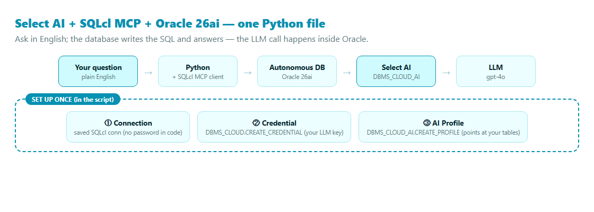
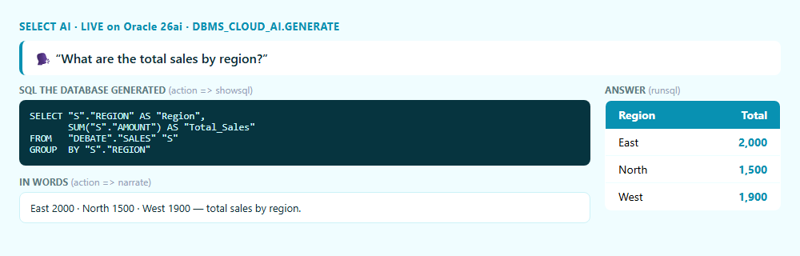

# Select AI + SQLcl MCP + Autonomous Database — in One Python File

*Connect, set up Select AI, and ask your Oracle 26ai database a question in plain English — start to finish in a single script.*

---

Three Oracle 26ai pieces, wired together in one short Python file: the **SQLcl MCP Server** for a safe connection, **Select AI** so the database can turn English into SQL, and your **Autonomous Database** holding the data. The neat part — the LLM call happens *inside* Oracle, so your app code never touches the model.


*One file: connection (no password in code) → credential (your LLM key) → AI profile → ask.*

## Step 0 — connect through the SQLcl MCP Server

```
sql /nolog
SQL> conn -save DEBATE -savepwd <user>@<adb-tns-alias>
```
```python
params = StdioServerParameters(command="sql", args=["-mcp"], env=dict(os.environ))
async with stdio_client(params) as (read, write):
    async with ClientSession(read, write) as s:
        await s.initialize()
        await s.call_tool("connect", {"connection_name": "DEBATE"})
        await s.call_tool("run-sql", {"sql": "SELECT USER FROM dual"})
```

## Step 1 — a credential + an AI profile

```sql
DBMS_CLOUD.CREATE_CREDENTIAL(
  credential_name => 'OPENAI_CRED', username => 'OPENAI', password => '<api-key>');

DBMS_CLOUD_AI.CREATE_PROFILE(
  profile_name => 'SALES_AI',
  attributes   => '{"provider":"openai","credential_name":"OPENAI_CRED",
                    "object_list":[{"owner":"DEBATE","name":"SALES"}],"model":"gpt-4o"}');
DBMS_CLOUD_AI.SET_PROFILE('SALES_AI');
```

> 🔑 **One-time admin grant.** The database must be allowed to reach the LLM endpoint:
> ```sql
> BEGIN
>   DBMS_NETWORK_ACL_ADMIN.APPEND_HOST_ACE(
>     host => 'api.openai.com',
>     ace  => xs$ace_type(privilege_list => xs$name_list('http'),
>                         principal_name => 'DEBATE', principal_type => xs_acl.ptype_db));
> END;
> /
> ```

## Step 2 — ask in English

```sql
SELECT DBMS_CLOUD_AI.GENERATE(
         prompt       => 'What are the total sales by region?',
         profile_name => 'SALES_AI',
         action       => 'runsql')      -- or 'showsql', or 'narrate'
FROM dual;
```


*A live `DBMS_CLOUD_AI.GENERATE` run on Oracle 26ai — ask in English, the database writes the `GROUP BY` and returns the answer.*

## Run it

```
pip install -r requirements.txt
copy .env.example .env          # OPENAI_API_KEY + ORACLE_MCP_CONNECTION
python select_ai_mcp.py
```

The script is self-contained: it connects, builds a tiny `sales` table, creates the credential and profile, and asks the question — and if the network grant is missing, it prints exactly what your DBA needs to run.

## Why it's nice

- **The LLM lives in the database.** Your app sends a question, not a prompt.
- **No password in code.** The MCP connection is saved in SQLcl; the LLM key is a database credential.
- **Scoped + safe.** The profile lists exactly which tables Select AI may read.

📦 **Full code on GitHub:** [github.com/khadayatepa/select-ai-mcp](https://github.com/khadayatepa/select-ai-mcp)

---

*About the author: **Prashant Khadayate** is an **Oracle ACE** focused on the Oracle AI Database (26ai), AI Vector Search, and the SQLcl MCP Server. Connect on [LinkedIn](https://www.linkedin.com/in/prashant-khadayate-1a8b0b97/) for more hands-on Oracle AI experiments.*

> A learning demo.
